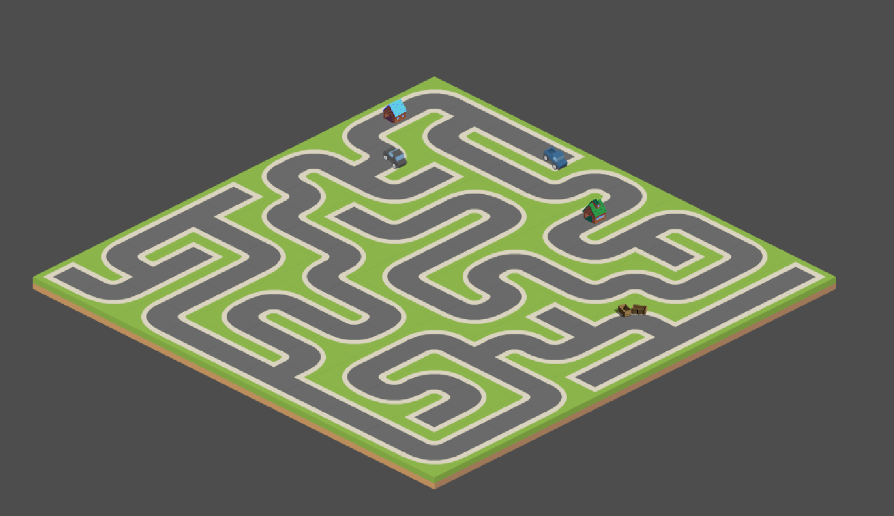

# The maze runner workshop

This project designed to be a server for all participants. It's generating a perfect maze, spawns a key to collect, and us it to escape the maze.
So in other words, participants will have A, B, C locations in the maze. 

> The main focus to have a programming session during the workshop and having fun in different scenarios. 
> `Back-end` scenario, participants could see a visualization of a maze with the player's movements and scores.
> `Front-end` - Client (Game with an engine or JS app whatever) scenario, build a visualization of zero player game experience.

#### Back-end scenario (Main)

`Idea`: Allow participants to practices with graph construction and node by parsing maze string data. Then they could navigate inside maze a player by sending HTTP requests API.

`Value`: Build an understanding of data structures like graphs, objects, arrays, etc. Algorithms like graph traversing, pathfinding inside a maze. Working with HTTP protocol and authorization principles.


#### Front-end scenario:

`Idea`: Participants could implement a game client to visualize maze and player movements by using the UDP protocol.

`Value`: Build an understanding of how game clients constructed, scene management, assets, game stats, and game managers. Network programming is based on UDP protocol.

___

*As extra, I had thoughts for evolutional ideas for this workshop project*
 - AI (Bot) writing to compete with other participants inside one server by submitting scripts. *Requires infrastructure to execute scripts and project refactor.
 - Refactor to provide "fog of war" where the player is located instead of giving encoded string with the whole maze. The participant will learn how to write search algorithms and constructing maps.

#### Project details

```text
.
├── api
│   ├── game
│   └── player
├── generator
├── manager
├── maze
│   └── asset
└── validator
```

##### User API 
Inside you can find 2 different API realizations, one for HTTP calls and others for UDP communications. 
	- UDP: Allows you to get maze maps and get locations of player's movements.
	- HTTP: Most expanded, check `rest-api.http` for API calls examples. But generally, you can get encoded maze, player data, locations.

`About encoded maze` explanations. To get it to send a request to `GET http://localhost:{your_port}}/world`, then you will get a structure like:
```json
{
  "message": {
    "maze_nodes": [
      "0 1, -1 -1, 1 1",
      "0 0, 0 1, -1 -1",
      "1 1, -1 -1, -1 -1",
      "1 0, 1 1, -1 -1"
    ],
    "locations": {
      "exit": {
        "x": 0,
        "y": 1
      },
      "key": {
        "x": 1,
        "y": 1
      },
      "start": {
        "x": 1,
        "y": 0
      }
    }
  },
  "status": 200
}
```

So we have under `maze_nodes` lines like - `0 0, 0 1, -1 -1`. It's cells\nodes maze, and 2 digits before ',' belongs to coordinate axis(x, y).
Let me expand it: `0 0, 0 1, -1 -1` = `current`, `right`, `bottom` cell with `x,y`. If you see there `-1 -1` that means cell is blocked and there is no connection.
So if we will put all together then it will be like:
```
+---+---+
|     E |
+---+   +
| S   K |
+---+---+
```

And yes, how to win the game? Simple, find a path from `S` (Starting point) to `K` (Keypoint) then deliver it to `E` (Ending point). Then API will serve to you like a teapot, game over :)

#### How to use project

It's totally on you, I decide to open it because it's fun to play around with that. It could be your Kata or you can use it for education session for colleagues or just grab a beer with mates and make a game :)

Here example game client:


